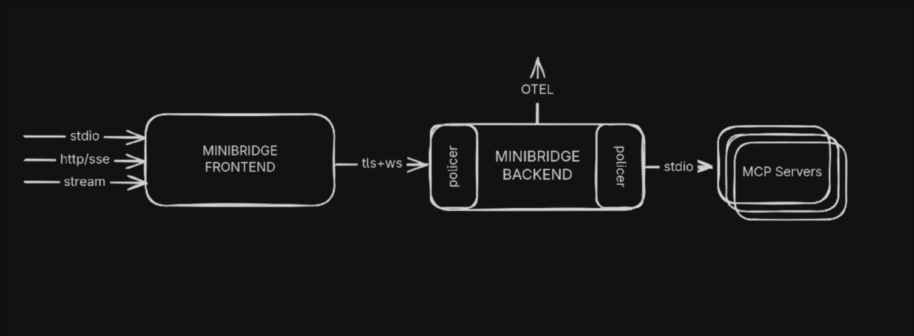

# Minibridge

[](https://github.com/acuvity/minibridge/actions/workflows/build.yaml)
[](https://goreportcard.com/report/github.com/acuvity/minibridge)
[](https://pkg.go.dev/github.com/acuvity/minibridge)
[](https://hub.docker.com/u/acuvity?page=1&search=mcp-server)

Minibridge serves as a backend-to-frontend bridge, streamlining and securing
communication between Agents and MCP servers. It safely exposes [MCP
servers](https://modelcontextprotocol.io) to the internet and can optionally
integrate with generic policing services — known as Policers — for agent
authentication, content analysis, and transformation. Policers can be
implemented remotely via HTTP or locally using [OPA
Rego](https://www.openpolicyagent.org/docs/latest/policy-reference/) policies.

Minibridge can help ensure the integrity of MCP servers through
SBOM (Software Bill of Materials) generation and real-time validation.

Additionally, Minibridge supports [OTEL](https://opentelemetry.io/) and can
report/rettach spans from classical OTEL headers, as well as directly from the
MCP call, as inserted by certain tool like [Open
Inference](https://arize-ai.github.io/openinference).



- **Minibridge Frontend**: The Client connects to the Frontend part of Minibridge.
- **Minibridge Backend**: The Frontend connects to the Backend which wraps the MCP server.
- **Minibridge Policer**: The Policer runs in the Backend and can optionally take decision on the input and output based on some policies (locally with Rego or remotely using HTTPs)

> [!TIP]
> Conveniently, Minibridge can be started in an "all-in-one" (AIO) mode to act as a single process.

## Why using Minibridge ?

Minibridge covers the following:

- **Secure Transport**: Use TLS with optionally, client certificate validation
- **Integrity**: Ensure the MCP server can not mutate tools, templates, etc. during the execution
- **User Authentication**: Transport the user information to the Policer
- **Monitoring**: Expose prometheus metrics
- **Telemetry**: Report traces and spans using Opentelemetry

## Installation

Minibridge can be installed from various places:

### Homebrew

On macOS, you can use Homebrew

```console
brew tap acuvity/tap
brew install minibridge
```

### AUR

On Arch based Linux distributions, you can run:

```json
yay -S minibridge
```

Alternatively, to get the latest version from the main branch:

```json
yay -S minibridge-git
```

### Go

If you have the Go toolchain install:

```console
go install go.acuvity.ai/minibridge@latest
```

Alternatively, to get the latest version from the main branch:

```console
go install go.acuvity.ai/minibridge@main
```

### Manually

You can easily grab a binary version for your platform from the [release
page](https://github.com/acuvity/minibridge/releases/tag/v0.6.2).


## Features comparisons

| 🚀 **Feature**                 | 🔹 **MCP**  | 🔸 **Minibridge** | 📦 **ARC (Acuvity Containers)** |
| ------------------------------ | ----------- | ----------------- | ------------------------------- |
| 🌐 Remote Access               | ⚠️          | ✅                | ✅                              |
| 🔒 TLS Support                 | ❌          | ✅                | ✅                              |
| 📃 Tool integrity check        | ❌          | ✅                | ✅                              |
| 📊 Visualization and Tracing   | ❌          | ✅                | ✅                              |
| 🛡️ Isolation                   | ❌          | ⚠️                | ✅                              |
| 🔐 Security Policy Management  | ❌          | 👤                | ⚠️                              |
| 🕵️ Secrets Redaction           | ❌          | 👤                | ⚠️                              |
| 🔑 Authorization Controls      | ❌          | 👤                | 👤                              |
| 🧑‍💻 PII Detection and Redaction | ❌          | 👤                | 👤                              |
| 📌 Version Pinning             | ❌          | ❌                | ✅                              |

✅ _Included_ | ⚠️ _Partial/Basic Support_ | 👤 _Custom User Implementation_ | ❌ _Not Supported_

## Example: Configuring Minibridge in your MCP Client

Suppose your client configuration originally specifies an MCP server like this:

```json
{
  "mcpServers": {
    "fetch": {
      "command": "uvx",
      "args": ["mcp-server-fetch"]
    }
  }
}
```

To route requests through Minibridge (enabling SBOM checks, policy enforcement, etc.), update the entry:

```json
{
  "mcpServers": {
    "fetch": {
      "command": "minibridge",
      "args": ["aio", "--", "uvx", "mcp-server-fetch"]
    }
  }
}
```

- **`minibridge aio`**: Invokes Minibridge in “all-in-one” mode, wrapping the downstream tool.
- **`uvx mcp-server-fetch`**: The original MCP server command, now executed inside Minibridge.

> [!TIP]
> The location of the configuration files depends on your Client. For example, if you use Claude Desktop, configuration files are located:
>
> - macOS: `~/Library/Application Support/Claude/claude_desktop_config.json`
> - Windows: `%APPDATA%\Claude\claude_desktop_config.json`
>
> See the official [MCP QuickStart for Claude Desktop Users](https://modelcontextprotocol.io/quickstart/user#2-add-the-filesystem-mcp-server) documentation.

> [!IMPORTANT]
> Your client must be able to resolve the path of the binary.
> If you see an error like `MCP fetch: spawn minibridge ENOENT`, set the `command` parameter above to the full path of minibridge (`which minibridge` will give you the full path).

## Documentation

Check out the complete [documentation](https://github.com/acuvity/minibridge/wiki) from the wiki pages.

## Contribute

We are excited to welcome contributions from everyone! 🎉 Whether you're fixing bugs, enhancing features, improving documentation, or proposing entirely new ideas, your involvement helps strengthen the project and benefits the entire community.

You do not need to sign a Contributor License Agreement (CLA) — just open a pull request and let's collaborate!

## Join us

- [Discord](https://discord.gg/BkU7fBkrNk)
- [LinkedIn](https://www.linkedin.com/company/acuvity)
- [Bluesky](https://bsky.app/profile/acuvity.bsky.social)
- [Docker](https://hub.docker.com/u/acuvity)
