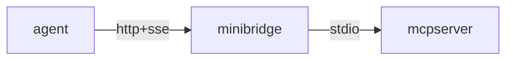
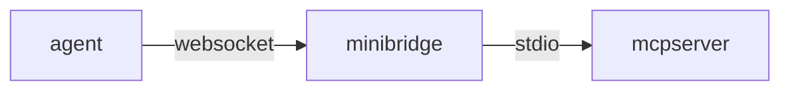
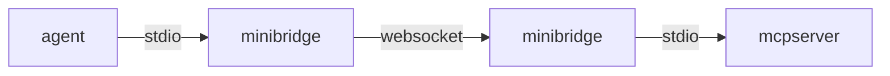
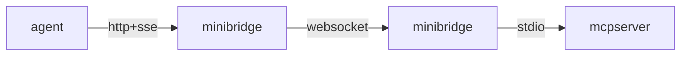

# minibridge

Minibridge serves as a bridge between MCP servers and the outside world. It
functions as a backend-to-frontend connector, facilitating communication between
Agents and MCP servers. It securely exposes MCP servers to the internet and
optionally enables seamless integration with the Acuvity Platform.

Minibridge does not need to interpret the core MCP protocol, as it only handles
data streams. This design ensures forward compatibility with future changes to
the MCP protocol.

Currently, Minibridge is compatible with any compliant MCP server using protocol
version 2024-11-05. Support for version 2025-03-26 is in progress.

> Note: Minibridge is still under active development.

## All In One

Minibridge can act as a single gateway positioned in front of a standard
stdio-based MCP server.

To start everything as a single process, run:

    minibridge aio --listen :8000 -- npx -y @modelcontextprotocol/server-filesystem /tmp

This command launches both the frontend and backend within a single process,
which can be useful in certain scenarios.

The flow will look like the following:



## Backend

Starting the backend launches an MCP server and exposes its API over a
WebSocket-based interface. TLS can be configured, with or without client
certificates, depending on your security requirements.

For example, to start a filesystem-based MCP server:

    minibridge backend -- npx -y @modelcontextprotocol/server-filesystem /tmp

You can now connect directly using a websocket client:

    wscat --connect ws://127.0.0.1:8080/ws

> NOTE: use the `wss` scheme if you have started minibridge backend with TLS.

> NOTE: Today, minibridge backend only supports MCP server over stdio.

The flow will look like the following:



## Frontend

While WebSockets address many of the limitations of plain POST+SSE, they are not
yet part of the official MCP protocol. To maintain backward compatibility with
existing agents, the frontend can expose a local interface using POST+SSE,
HTTP+STREAM (coming soon), or plain STDIO. It will then transparently forward
the data to the Minibridge backend over WebSockets and HTTPS.

### Stdio Frontend

To start an stdio frontend:

    minibridge frontend --backend wss://127.0.0.1:8000/ws

You can then send requests via stdin and read responses from stdout. The
frontend maintains a single WebSocket connection to the backend and will
automatically reconnect in case of failures.

The flow will look like the following:



### SSE Frontend

To start an SSE frontend:

    minibridge frontend --listen :8081 --backend wss://127.0.0.1:8000/ws

In this mode, a new WebSocket connection is established with the backend for
each incoming connection to the /sse endpoint. This preserves session state.
However, the WebSocket will not attempt to reconnect in this mode, and any
active streams will be terminated in the event of a network failure.

The flow will look like the following:



## Policer Integration

While Minibridge already offers advanced features such as strong client
authentication and native WebSocket support, it can be further enhanced through
integration with a Policer. A Policer is responsible for:

* User authentication
* Role-based user authorization
* Input analysis and logging
* Full request tracing
* And more advanced policy-based controls

The Policer, if set, will be called and passed various information so it can
make a decision on what to do with the request, based on the user who initiated
the request and the content of the request.

You can then start Minibridge, using either the aio or backend subcommand, with
the following arguments:

    minibridge aio --policer-url https://policer.acme.com/police --policer-token $APPTOKEN

Once integrated, any command from the user or response from the MCP Server
received by the backend is first passed to the Policer for authentication and/or
analysis.

The Policer receives a `POST` request at the `--policer-url` endpoint in the
following format:

```json
{
  "messages": ["{\"jsonrpc\":\"2.0\",\"method\":\"tools/list\",\"id\":1}"],
  "type":"Input"
}
```

> NOTE: for a response from the MCP Server, the `type` will be set to `Output`.

The Policer must respond with an HTTP status code `200 OK` if the request passes
the policy checks. Any other status code will be treated as a failure, and the
request will be blocked.

For a policy decision that permits the request:

```json
{
  "decision": "Allow"
}
```

For a policy result that denies the request:

```json
{
  "decision": "Deny",
  "reasons": ["You are not allowed to use this tool"]
}
```


If the request is denied (or the Policer does not return `200 OK`), Minibridge
will not forward it to the MCP server. Instead, it will return a descriptive MCP
error to the client, indicating why the request was blocked.

Example:

    $ mcptools tools http://127.0.0.1:8000
    error: RPC error 451: request blocked: ForbiddenUser: I'm afraid you cannot do this, Dave
