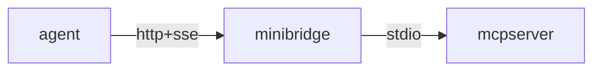
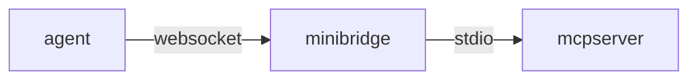
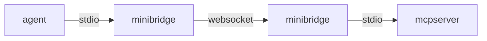
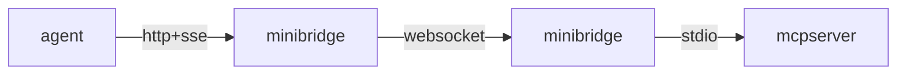

# minibridge

Minibridge serves as a bridge between MCP servers and the outside world. It
functions as a backend-to-frontend connector, facilitating communication between
Agents and MCP servers. It allows to securely exposes MCP servers to the internet and
optionally enables seamless integration with a generic policing service for
agent authentication and content analysis.

Minibridge does not need to interpret the core MCP protocol, as it only handles
data streams. This design ensures forward compatibility with future changes to
the MCP protocol.

Currently, Minibridge is compatible with any compliant MCP server using protocol
version 2024-11-05. Support for version 2025-03-26 is in progress.

> Note: Minibridge is still under active development.


## Table of Content

<!-- vim-markdown-toc GFM -->

* [All In One](#all-in-one)
* [Backend](#backend)
* [Frontend](#frontend)
  * [Stdio](#stdio)
  * [HTTP+SSE](#httpsse)
* [Policer](#policer)
  * [Police Request API](#police-request-api)
  * [Police Response API](#police-response-api)
  * [Agent Authentication](#agent-authentication)
    * [Global](#global)
    * [Forward](#forward)
* [Todos](#todos)

<!-- vim-markdown-toc -->

## All In One

Minibridge can act as a single gateway positioned in front of a standard
stdio-based MCP server.

To start everything as a single process, run:

    minibridge aio --listen :8000 -- npx -y @modelcontextprotocol/server-filesystem /tmp

This command launches both the frontend and backend within a single process,
which can be useful in certain scenarios.

You can connect directly using an HTTP client:

    $ curl http://127.0.0.1:8000/sse
    event: endpoint
    data: /message?sessionId=UID

    $ curl http://127.0.0.1:8000/message?sessionId=UID \
      -X POST \
      -d '{"jsonrpc":"2.0","id":2,"method":"tools/list"}'

The flow will look like the following:



In order to secure the connections, you need to enable HTTPS for incoming
connections:

    minibridge aio --listen :8443 \
      --tls-server-cert ./server-cert.pem \
      --tls-server-key ./server-key.pem \
      --tls-server-client-ca ./clients-ca.pem \
      -- npx -y @modelcontextprotocol/server-filesystem /tmp

This enables HTTPS and with `--tls-server-client-ca`, it requires the clients to
send a certificate signed by that client CA.

You can now connect directly using an HTTP client:

    $ curl https://127.0.0.1:8443/sse \
      --cacert ./server-cert.pem --cert ./client-cert.pem --key ./client-key.pem
    event: endpoint
    data: /message?sessionId=UID

    $ curl https://127.0.0.1:8443/message?sessionId=UID \
      --cacert ./server-cert.pem --cert ./client-cert.pem --key ./client-key.pem \
      -X POST \
      -d '{"jsonrpc":"2.0","id":2,"method":"tools/list"}'

## Backend

Starting the backend launches an MCP server and exposes its API over a
WebSocket-based interface. TLS can be configured, with or without client
certificates, depending on your security requirements.

For example, to start a filesystem-based MCP server:

    minibridge backend -- npx -y @modelcontextprotocol/server-filesystem /tmp

You can now connect directly using a websocket client:

    wscat --connect ws://127.0.0.1:8000/ws

> NOTE: use the `wss` scheme if you have started minibridge backend with TLS.

> NOTE: Today, minibridge backend only supports MCP server over stdio.

The flow will look like the following:



In order to secure the connections, you need to enable HTTPS for incoming
connections:

    minibridge backend --listen :8443 \
      --tls-server-cert ./backend-server-cert.pem \
      --tls-server-key ./backend-server-key.pem \
      --tls-server-client-ca ./clients-ca.pem \
      -- npx -y @modelcontextprotocol/server-filesystem /tmp

This enables HTTPS and with `--tls-server-client-ca`, it requires the clients to
send a certificate signed by that client CA. You can now connect using:

    wscat --connect wss://127.0.0.1:8443/ws \
      --ca ./server-cert.pem \
      --cert ./client-cert.pem

## Frontend

While WebSockets address many of the limitations of plain POST+SSE, they are not
yet part of the official MCP protocol. To maintain backward compatibility with
existing agents, the frontend can expose a local interface using POST+SSE,
HTTP+STREAM (coming soon), or plain STDIO. It will then transparently forward
the data to the Minibridge backend over WebSockets and HTTPS.

### Stdio

To start an stdio frontend:

    minibridge frontend --backend wss://127.0.0.1:8000/ws

You can then send requests via stdin and read responses from stdout. The
frontend maintains a single WebSocket connection to the backend and will
automatically reconnect in case of failures.

The flow will look like the following:



### HTTP+SSE

To start an SSE frontend:

    minibridge frontend --listen :8081 --backend wss://127.0.0.1:8000/ws

In this mode, a new WebSocket connection is established with the backend for
each incoming connection to the /sse endpoint. This preserves session state.
However, the WebSocket will not attempt to reconnect in this mode, and any
active streams will be terminated in the event of a network failure.

You can connect directly using an HTTP client:

    $ curl http://127.0.0.1:8001/sse
    event: endpoint
    data: /message?sessionId=UID

    $ curl http://127.0.0.1:8001/message?sessionId=UID \
      -X POST \
      -d '{"jsonrpc":"2.0","id":2,"method":"tools/list"}'

The flow will look like the following:



In order to secure the connections, you need to enable HTTPS for incoming
connections:

    minibridge frontend --listen :8444 \
      --backend wss://127.0.0.1:8000/ws
      --tls-server-cert ./server-cert.pem \
      --tls-server-key ./server-key.pem \
      --tls-server-client-ca client-ca.pem ]\
      --tls-client-cert ./client-cert.pem \
      --tls-client-key ./client-key.pem \
      --tls-client-backend-ca ./backend-server-cert.pem

This enables HTTPS and with `--tls-server-client-ca`, it requires the clients to
send a certificate signed by that client CA. It also make the front end to
authenticate to the backend using the provided client certificate (MTLS).

You can now connect directly using an HTTP client:

    $ curl https://127.0.0.1:8444/sse \
      --cacert ./server-cert.pem --cert ./client-cert.pem --key ./client-key.pem
    event: endpoint
    data: /message?sessionId=UID

    $ curl https://127.0.0.1:8444/message?sessionId=UID \
      --cacert ./server-cert.pem --cert ./client-cert.pem --key ./client-key.pem \
      -X POST \
      -d '{"jsonrpc":"2.0","id":2,"method":"tools/list"}'

## Policer

While Minibridge already offers advanced features such as strong client
authentication and native WebSocket support, it can be further enhanced through
integration with a Policer. A Policer is responsible for:

* Authentication
* Authorization
* Input analysis and logging
* Full request tracing
* And more advanced policy-based controls

The Policer, if set, will be called and passed various information so it can
make a decision on what to do with the request, based on the user who initiated
the request and the content of the request.

> NOTE: You can find an example of a policer in `policers/example`.

You can then start Minibridge, using either the aio or backend subcommand, with
the following arguments:

    minibridge aio --policer-url https://policer.acme.com/police --policer-token $PTOKEN

Once integrated, any command from the user or response from the MCP Server
received by the backend is first passed to the Policer for authentication and/or
analysis.

### Police Request API

The Policer receives a `POST` request at the `--policer-url` endpoint in the
following format:

```json
{
  "type": "input"
  "agent": {
    "token": "<agent-token>",
    "userAgent": "curl/7.54.1",
    "remoteAddr": "10.0.1.265:44536",
  },
  "mcp": {
    "jsonrpc": "2.0",
    "id": 1,
    "method": "tools/list",
  }
}
```

> NOTE: for a response from the MCP Server, the `type` will be set to `output`
and no user will be passed.

> NOTE: minibrige `--policer-token` will be passed in the `Authorization`
> header of the POST request made to the policer.

### Police Response API

The Policer must respond with an HTTP status code `200 OK` if the request passes
the policy checks. Any other status code will be treated as a failure, and the
request will be blocked.

For a policy decision that permits the request:

```json
{
  "decision": "allow"
}
```

For a policy result that denies the request:

```json
{
  "decision": "deny",
  "reasons": ["You are not allowed to list the tools"]
}
```

If the request is denied (or the Policer does not return `200 OK`), Minibridge
will not forward it to the MCP server. Instead, it will return a descriptive MCP
error to the client, indicating why the request was blocked.

Example:

    $ mcptools tools http://127.0.0.1:8000
    error: RPC error 451: request blocked: ForbiddenUser: You are not allowed to list the tools

### Agent Authentication

The frontend can forward the agent credentials using two modes.

#### Global

This mode uses a single token set during the Minibridge frontend startup. It is
useful when there is only one user of the bridge — such as when it is running on a
user’s laptop and connecting to a remote Minibridge backend.

To start the frontend in that mode:

    minibridge frontend -l :8000 -A wss://backend.minibridge.acme.com/ws --agent-token "$TOKEN"

#### Forward

This mode simply forwards the HTTP `Authorization` header to the Minibridge
backend. It is useful when the frontend runs on a public network and you want
the policer to authenticate multiple callers.

To start the frontend in that mode:

    minibridge frontend -l :8000 -A wss://backend.minibridge.acme.com/ws --agent-token-passthrough

## Todos

Minibridge is still missing the following features:

- [ ] Unit tests
- [x] Transport user information over the websocket channel
- [x] Support for user extraction to pass to the policer
- [ ] Optimize communications between front/back in aio mode
- [ ] Plug in prometheus metrics
