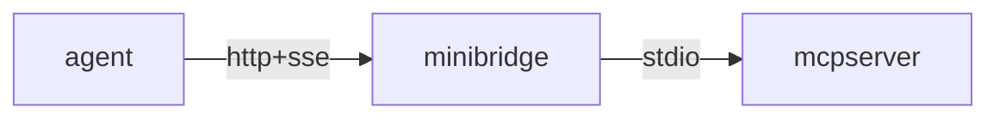
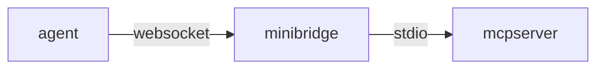
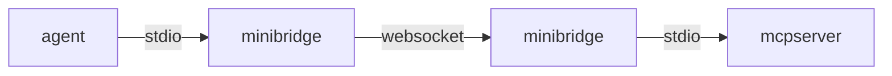
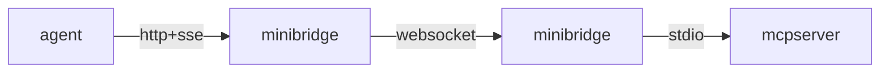

# Minibridge

Minibridge serves as a backend-to-frontend bridge, streamlining and securing
communication between Agents and MCP servers. It safely exposes MCP servers to
the internet and can optionally integrate with generic policing services — known
as Policers — for agent authentication, content analysis, and transformation.
Policers can be implemented remotely via HTTP or locally using OPA Rego
policies.

Additionally, Minibridge can help ensure the integrity of MCP servers through
SBOM (Software Bill of Materials) generation and real-time validation.

## Table of Content

<!-- vim-markdown-toc GFM -->

* [All In One](#all-in-one)
* [Backend](#backend)
* [Frontend](#frontend)
  * [Stdio](#stdio)
  * [HTTP+SSE](#httpsse)
* [MCP Server Integrity Check](#mcp-server-integrity-check)
  * [Generate SBOM](#generate-sbom)
  * [Check SBOM Offline](#check-sbom-offline)
  * [Check SBOM Online](#check-sbom-online)
  * [Dump everything](#dump-everything)
* [Policer](#policer)
  * [Policer API](#policer-api)
    * [Police Request](#police-request)
    * [Police Response](#police-response)
  * [Available Policers](#available-policers)
    * [HTTP Policer](#http-policer)
    * [Rego Policer](#rego-policer)
  * [Agent Authentication](#agent-authentication)
    * [Global](#global)
    * [Forward](#forward)
* [Todos](#todos)

<!-- vim-markdown-toc -->

## All In One

Minibridge can act as a single gateway positioned in front of a standard
stdio-based MCP server.

To start everything as a single process, run:

    minibridge aio --listen :8000 -- npx @modelcontextprotocol/server-filesystem /tmp

This command launches both the frontend and backend within a single process,
which can be useful in certain scenarios.

You can connect directly using an HTTP client:

    $ curl http://127.0.0.1:8000/sse
    event: endpoint
    data: /message?sessionId=UID

    $ curl http://127.0.0.1:8000/message?sessionId=UID \
      -X POST \
      -d '{"jsonrpc":"2.0","id":2,"method":"tools/list"}'

The flow will look like the following:



In order to secure the connections, you need to enable HTTPS for incoming
connections:

    minibridge aio --listen :8443 \
      --tls-server-cert ./server-cert.pem \
      --tls-server-key ./server-key.pem \
      --tls-server-client-ca ./clients-ca.pem \
      -- npx @modelcontextprotocol/server-filesystem /tmp

This enables HTTPS and with `--tls-server-client-ca`, it requires the clients to
send a certificate signed by that client CA.

You can now connect directly using an HTTP client:

    $ curl https://127.0.0.1:8443/sse \
      --cacert ./server-cert.pem --cert ./client-cert.pem --key ./client-key.pem
    event: endpoint
    data: /message?sessionId=UID

    $ curl https://127.0.0.1:8443/message?sessionId=UID \
      --cacert ./server-cert.pem --cert ./client-cert.pem --key ./client-key.pem \
      -X POST \
      -d '{"jsonrpc":"2.0","id":2,"method":"tools/list"}'

## Backend

Starting the backend launches an MCP server and exposes its API over a
WebSocket-based interface. TLS can be configured, with or without client
certificates, depending on your security requirements.

For example, to start a filesystem-based MCP server:

    minibridge backend -- npx @modelcontextprotocol/server-filesystem /tmp

You can now connect directly using a websocket client:

    wscat --connect ws://127.0.0.1:8000/ws

> NOTE: use the `wss` scheme if you have started Minibridge backend with TLS.

> NOTE: Today, Minibridge backend only supports MCP server over stdio.

The flow will look like the following:



In order to secure the connections, you need to enable HTTPS for incoming
connections:

    minibridge backend --listen :8443 \
      --tls-server-cert ./backend-server-cert.pem \
      --tls-server-key ./backend-server-key.pem \
      --tls-server-client-ca ./clients-ca.pem \
      -- npx @modelcontextprotocol/server-filesystem /tmp

This enables HTTPS and with `--tls-server-client-ca`, it requires the clients to
send a certificate signed by that client CA. You can now connect using:

    wscat --connect wss://127.0.0.1:8443/ws \
      --ca ./server-cert.pem \
      --cert ./client-cert.pem

## Frontend

While WebSockets address many of the limitations of plain POST+SSE, they are not
yet part of the official MCP protocol. To maintain backward compatibility with
existing agents, the frontend can expose a local interface using POST+SSE,
HTTP+STREAM (coming soon), or plain STDIO. It will then transparently forward
the data to the Mminibridge backend over WebSockets and HTTPS.

### Stdio

To start an stdio frontend:

    minibridge frontend --backend wss://127.0.0.1:8000/ws

You can then send requests via stdin and read responses from stdout. The
frontend maintains a single WebSocket connection to the backend and will
automatically reconnect in case of failures.

The flow will look like the following:



### HTTP+SSE

To start an SSE frontend:

    minibridge frontend --listen :8081 --backend wss://127.0.0.1:8000/ws

In this mode, a new WebSocket connection is established with the backend for
each incoming connection to the /sse endpoint. This preserves session state.
However, the WebSocket will not attempt to reconnect in this mode, and any
active streams will be terminated in the event of a network failure.

You can connect directly using an HTTP client:

    $ curl http://127.0.0.1:8001/sse
    event: endpoint
    data: /message?sessionId=UID

    $ curl http://127.0.0.1:8001/message?sessionId=UID \
      -X POST \
      -d '{"jsonrpc":"2.0","id":2,"method":"tools/list"}'

The flow will look like the following:



In order to secure the connections, you need to enable HTTPS for incoming
connections:

    minibridge frontend --listen :8444 \
      --backend wss://127.0.0.1:8000/ws
      --tls-server-cert ./server-cert.pem \
      --tls-server-key ./server-key.pem \
      --tls-server-client-ca client-ca.pem ]\
      --tls-client-cert ./client-cert.pem \
      --tls-client-key ./client-key.pem \
      --tls-client-backend-ca ./backend-server-cert.pem

This enables HTTPS and with `--tls-server-client-ca`, it requires the clients to
send a certificate signed by that client CA. It also make the front end to
authenticate to the backend using the provided client certificate (MTLS).

You can now connect directly using an HTTP client:

    $ curl https://127.0.0.1:8444/sse \
      --cacert ./server-cert.pem --cert ./client-cert.pem --key ./client-key.pem
    event: endpoint
    data: /message?sessionId=UID

    $ curl https://127.0.0.1:8444/message?sessionId=UID \
      --cacert ./server-cert.pem --cert ./client-cert.pem --key ./client-key.pem \
      -X POST \
      -d '{"jsonrpc":"2.0","id":2,"method":"tools/list"}'

## MCP Server Integrity Check

Minibridge can generate an SBOM file for a MCP server that contains hashes of
various parts interpreted by an LLM. This SBOM file can be used to check the MCP
Server did not change, either offline or online by passing it to the backend
that will inspect each relevant MCP call dynamically.

### Generate SBOM

To generate a SBOM file:

    minibridge scan sbom -- npx @modelcontextprotocol/server-everything > server.sbom

This will create `server.sbom` that contains all the hashes of the relevant
parts.

> NOTE: For now, only tools and prompts are part of the SBOM.

### Check SBOM Offline

To verify that an MCP server still matches a previously generated SBOM file:

    minibridge scan check server.sbom -- npx @modelcontextprotocol/server-everything

### Check SBOM Online

The SBOM file can be passed to the Minibridge backend to dynamically ensure no
LLM-interpreted parts have changed since the SBOM file generation.

For instance, it can make sure a tool that reads a file does not
suddenly change to a tool that sends all your credentials to some shady place.

To start Minibridge backend with live SBOM validation:

    minibridge backend -l :8000 --sbom server.sbom -- npx @modelcontextprotocol/server-everything

### Dump everything

Dump all the tools, prompts, resources and resource templates of a particular
MCP Server.

For example:

    minibridge scan dump -- npx @modelcontextprotocol/server-everything

## Policer

While Minibridge already offers advanced features such as strong client
authentication and native WebSocket support, it can be further enhanced through
integration with a Policer. A Policer is responsible for:

* Authentication
* Authorization
* Input analysis and logging
* Full request tracing
* And more advanced policy-based controls

There are various available policers in Minibridge:

- HTTP policer: sends a request to a remote HTTP service to delegate decision
- Rego policer: runs a [rego](https://www.openpolicyagent.org/docs/latest)
  policy file on the request

> NOTE: More policers will be added!

The Policer, if set, will be called and passed various information so it can
make a decision on what to do with the request, based on the user who initiated
the request and the content of the request.

You can then start Minibridge, using either the aio or backend subcommand, with
the following arguments to start an HTTP policer:

    minibridge aio --policer-type http \
      --policer-http-url https://policer.acme.com/police --policer-http-token $PTOKEN

Or using with the following command to start Minibridge with a Rego policer:

    minibridge aio --policer-type rego \
      --policer-rego-policy ./example/policer-rego/policy.rego

Once integrated, any command from the user or response from the MCP Server
received by the backend is first passed to the Policer for authentication and/or
analysis.

### Policer API

#### Police Request

The Policer will receives the following information:

```json
{
  "type": "request|response"
  "agent": {
    "token": "<agent-token>",
    "userAgent": "curl/7.54.1",
    "remoteAddr": "10.0.1.265:44536",
  },
  "mcp": {
    "jsonrpc": "2.0",
    "id": 1,
    "method": "tools/list",
  }
}
```

The Policer can use this information to decide if the request should be denied.

#### Police Response

The policer must return a response with the following information:

```json
{
  "allow": true,
  "reasons": ["reason 1", "reason 2"],
  "mcp": null,
}
```

If `allow` is `true`, the request or response is allowed and will be forwarded.

If `allowed` is `false`, then the request or response is considered as blocked
and Minibridge will not forward it to the MCP server or to the Agent. Instead,
it will return a descriptive MCP error containing the `reasons` (if any), to the
caller. If no `reasons` are set (empty or null), a generic reason will be
used.

In addition, if `allow` is `true`, and `mcp` is non null, Minibridge will swap
the original MCP call with the one provided in the response, allowing Policers
to mutate the call. For instance this can be used to hide some tools based on
the agent identity.

### Available Policers

#### HTTP Policer

The HTTP Policer will receive the Police Request as `POST` on the url provided
by `--provider-http-url`.

To allow the request or response, the HTTP Policer must respond with:

- An HTTP status `204 No Content`, or
- An HTTP status `200 OK` with `allow` property set `true`.

To disallow the request or response:

- An HTTP status `200 OK` with `allow` set to `false` and optional `reasons`.
- Any other HTTP code will also deny the request, but is considered as an error.


For example, a policy result that allows the request:

```http
HTTP/1.1 204 No Content
```

Or

```http
HTTP/1.1 200 OK


{ "allow": true }
```

And a policy result that denies the request:

```http
HTTP/1.1 200 OK


{ "allow": false, "reasons": ["You are not allowed to list the tools"] }
```


The HTTP Policer can also decide to mutate the MCP call. To do so, it must allow
the request, and pass back a modified MCP call:

```http
HTTP/1.1 200 OK


{
  "allow": true,
  "mcp": {
    "id": 2,
    "jsonrpc": "2.0",
    "result": {
    "tools": [{
      "description": "POLICER HAS MODIFIED THIS DESCRIPTION",
      "name": "echo"
    }]
  }
}
```

#### Rego Policer

The Rego Policer allows to run the Police Request through a rego policy to
decide if the request should be allowed or not. The Police Request is passed an
input, and the rego policy must either return and `allow := true` or an empty
`deny` string array.

> NOTE: the rego package must be named `main`.

For instance, to allow the request:

```regp
package main
import rego.v1

allow = true
```

To deny the request:

```rego
package main
import rego.v1

default allow := false

allow if {
  count(reasons) == 0
}

reasons contains msg if {
  input.agent.token == ""
  msg := "you must send a token"
}

reasons contains msg if {
  input.mcp.method == "tools/call"
  input.mcp.params.name == "printEnv"
  msg := "you cannot use printEnv"
}
```

### Agent Authentication

The frontend can forward the agent credentials using two modes.

#### Global

This mode uses a single token set during the Minibridge frontend startup. It is
useful when there is only one user of the bridge — such as when it is running on a
user’s laptop and connecting to a remote Minibridge backend.

To start the frontend in that mode:

    minibridge frontend -l :8000 -A wss://backend.minibridge.acme.com/ws --agent-token "$TOKEN"

#### Forward

This mode simply forwards the HTTP `Authorization` header to the Minibridge
backend. It is useful when the frontend runs on a public network and you want
the policer to authenticate multiple callers.

To start the frontend in that mode:

    minibridge frontend -l :8000 -A wss://backend.minibridge.acme.com/ws --agent-token-passthrough

## Todos

Minibridge is still missing the following features:

- [ ] Unit tests
- [x] Transport user information over the websocket channel
- [x] Support for user extraction to pass to the policer
- [ ] Optimize communications between front/back in aio mode
- [x] Plug in prometheus metrics
- [ ] Opentracing
